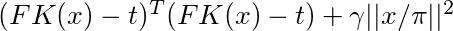
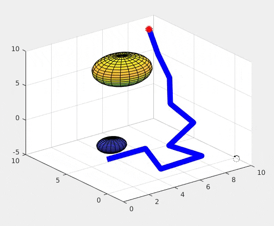
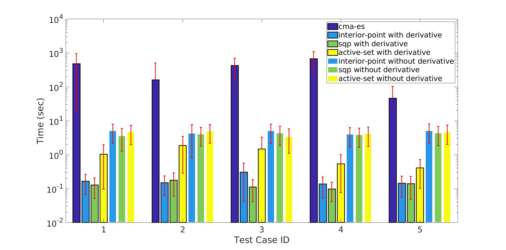
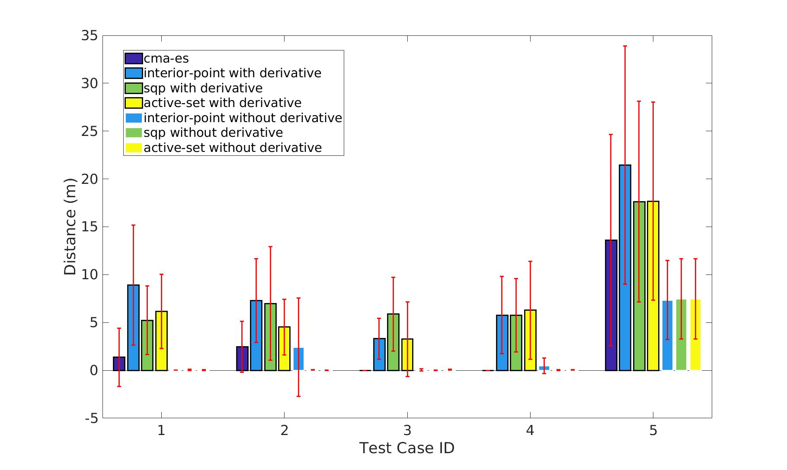
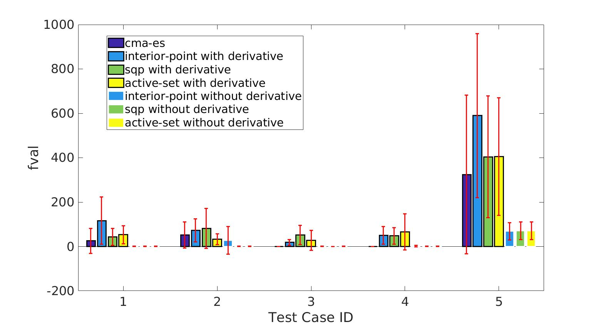
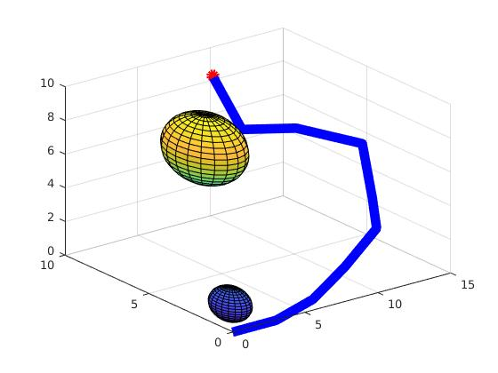
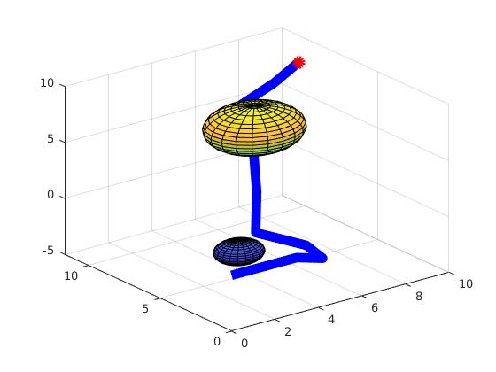
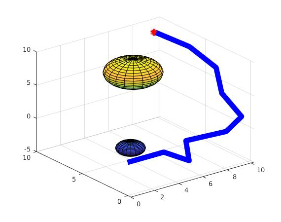
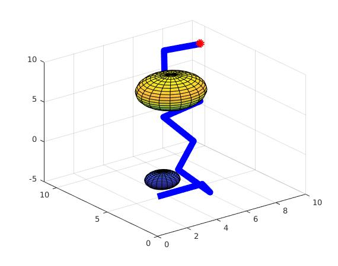

# 16745 Assignment 1
Sha Yi, andrew ID: shayi

Code can be downloaded [here](https://cmu.box.com/s/1rwu3xg7vuka4x92njslewv85skftf8h).

## Part 1: IK
I implemented the inverse kinematics with the given function signatures in `part1.m`. It takes the input target, links, and rotation limit information and outputs the desired joint angles.  
The design of the objective function takes into account the following criteria:
- The distance of the current end effector with the target pose, including translation `(x, y, z)` and orientation `(r, p, y)` as quaternion values;
- The angle at each joint should be far from the rotation limit for better execution. Since in most cases, the joints would have symmetric limits, i.e. the range for the joint angles is `(-t, t)` where `t` is the maximum angle the joint can execute. Therefore under this assumption, an additional term to minimize the norm of the joint angle vector.  

As discussed above, the final objective function is:  
  
where `t` is the target pose and `\gamma` is a weight for minimizing the joint angles of keeping away from its limit. In all my experiments, I am using `\gamma = 0.1`.

The result is shown with 3D plot as follows:  
  
The arm is shown in blue and target is shown in red. The obstacles are shown in colored spheres in the figure above. The result shows that the arm avoids collision with the two obstacles and successfully reaches the target location, as well as the target orientation.

## Part 2 & 3: Jacobian & Optimization Methods
In part 2 and 3, experiment is done with 5 different target location but with same obstacle configurations. In each scenario, it is tested with 10 random initializations. The metric for comparing optimization results includes:
- Runtime
- Distance to target, including translation and rotation
- The value of the objective function with the optimized output

In Part 2, Jacobian is calculated and provided as an input to the optimization function. In Part 3, the optimizer is given different optimization algorithm. 

I run the optimization with `interior-point`, `sqp`, `active-set` and `cma-es`. All algorithms are using the same objective function, except that `cma-es` needs to have non-linear constraints with the objective function and returns `NaN` when the constraint is violated.

The test cases includes 5 different configurations. In the first 4 cases, the target is within reach of the arm, and in the last case, the arm is not able to reach the target. The result from 5 runs is shown below:

We can see from the result of the time plot, all first three methods runs faster and gives better optimization result with a provided gradient. With gradient information, the first three can get nearly 0 in both distance and objective function values, since with analytical gradient, the optimizer have better estimation of the direction to go and thus giving better and faster result.  
In all cases, `cma-es` is able to provide better result compared with all other methods. The reason is that `cma-es` uses sample based approach and is not likely to get trapped in local optima.

## Part 4
Since in each run of the optimizer, I choose a random point within the lower and upper bound and use it as an initialization point for the optimizer. In this case, the user can run multiple times and choose a satisfactory result. 

For example, below is a set of possible results with the same environment and target pose. The user can choose from one of the result, or run other trials until a satisfactory result is generated.  

